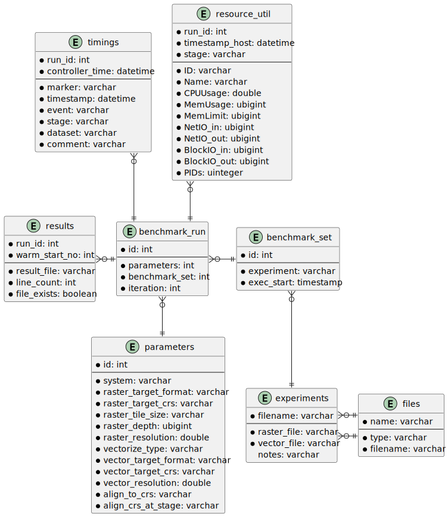

# Results Database

We decided to store almost all benchmark-related information in a database. For this purpose, we chose [_DuckDB_](https://duckdb.org/), a recently developed OLAP-focused in-file or in-memory database.

To keep redundancies at a minimum, we developed the schema in 3NF. Initial point of said schema is the `benchmark_set` table, which groups all benchmark runs based on a `experiments` file definition. The `benchmark_run` then acts as the core of the schema. It references exactly one parameter entry that is used for said run. From the point of view of the database, the system-under-test also is just one parameter attribute. The `benchmark_run` table also provides the `run_id`, which is the main reference for all other tables containing run-related data such as the aforementioned timing-information as well as information on resource utilization. 

The database also stores the location of the result files as well as some related metadata. While theoretically possible, we decided against storing the raw results in the database, because this would have required the schema to be flexible. We also decided against storing the results as unstructured data, which would not have yielded the improvements storing we were looking for. In theory though, it would be easily possible to store the results of the accuracy metric in the database by adding another entity type that connects to the `benchmark_run` table using a parallel relationship type.

